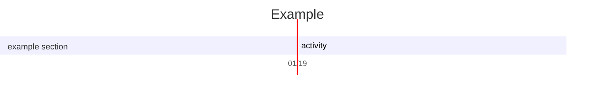
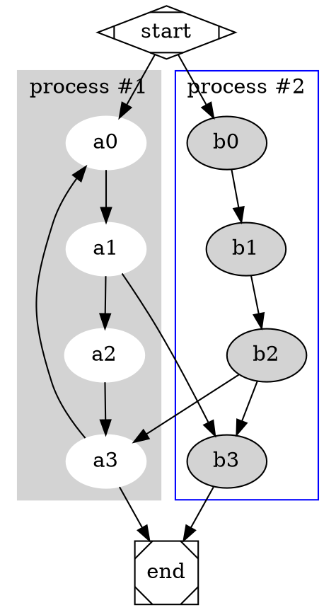

# 常用Markdown

## *斜体* **粗体**

[链接](www.baidu.com)

- 无序列表

1. 有序列表

> 引用

`行内代码:Hello World!`

```c
int main()
{
    return 0;
}
```

```markdown

```

~~删除线~~

$行内公式 E=mc^2$

$$整行公式$$

```c
int main()
{
    return 0;//语法高亮代码
}
```

| 项目 | 价格 | 数量 |
| ---- | ---: |:--: |
| 计算机 | \$1600 |  5   |
| 手机   |   \$12 |  12  |
| 管线   |    \$1 | 234  |

- [ ] 代办事项

${toc}
[[toc]]
[toc]
[[_toc_]]


@startuml
Bob -> Alice : hello
@enduml

``` plantuml
Bob -> Alice : hello
```



``` sequence-diagrams
Andrew->China: Says
Note right of China: China thinks\nabout it
China-->Andrew: How are you?
Andrew->>China: I am good thanks!
```

``` flowchart
st=>start: Start|past:>http://www.google.com[blank]
e=>end: End|future:>http://www.google.com
op1=>operation: My Operation|past
op2=>operation: Stuff|current
sub1=>subroutine: My Subroutine|invalid
cond=>condition: Yes
or No?|approved:>http://www.google.com
c2=>condition: Good idea|rejected
io=>inputoutput: catch something...|future

st->op1(right)->cond
cond(yes, right)->c2
cond(no)->sub1(left)->op1
c2(yes)->io->e
c2(no)->op2->e
```



``` chart
{
  "type": "pie",
  "data": {
    "labels": [
      "Red",
      "Blue",
      "Yellow"
    ],
    "datasets": [
      {
        "data": [
          300,
          50,
          100
        ],
        "backgroundColor": [
          "#FF6384",
          "#36A2EB",
          "#FFCE56"
        ],
        "hoverBackgroundColor": [
          "#FF6384",
          "#36A2EB",
          "#FFCE56"
        ]
      }
    ]
  },
  "options": {}
}
```
