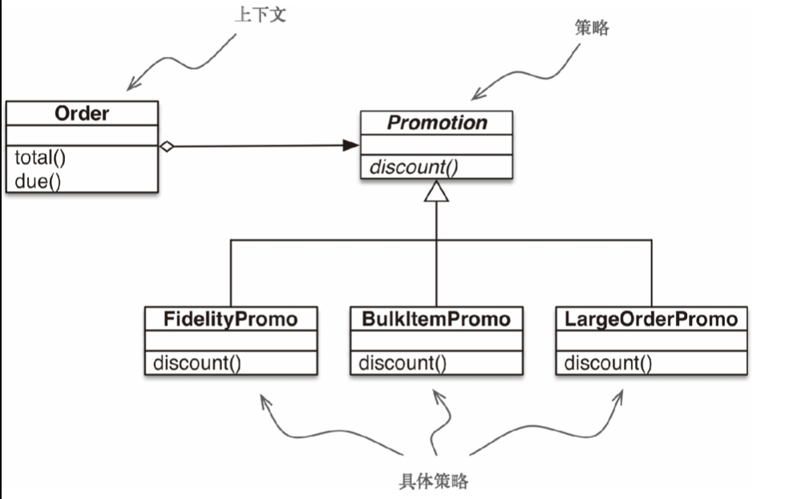

# 流畅的python

## 魔术方法

### 魔术方法(magic method)

- **len**,**getitem**(可迭代)

```python
import collections

Card = collections.namedtuple('Card', ['rank', 'suit'])
# namedtuple 构建只有少数属性但没方法的对象


class FrenchDeck:
    ranks = [str(n) for n in range(2, 11)] + list('JQKA')
    suits = 'spades diamonds clubs hearts'.split()

    def __init__(self):
        self._cards = [Card(rank, suit)
                       for suit in self.sults for rank in self.ranks]

    def __len__(self):
        return len(self._cards)

    def __getitem__(self, position):
        return self._cards[position]
```

- **repr**(字符串表示形式),**abs**(绝对值，若为复数，返回模),**add**(+),**mul**(*)

```python
from math import hypot


class Vector:
    def __init__(self, x=0, y=0):
        self.x = x
        self.y = y

    def __repr__(self):
        return 'Vector({},{})'.format(self.x, self.y)

    def __abs__(self):
        return hypot(self.x, self.y)

    def __bool__(self):
        return bool(abs(self))


    def __add__(self, other):
        x = self.x + other.x
        y = self.x + other.x
        return Vector(x, y)

    def __mul__(self, scalar):
        return Vector(self.x * scalar, self.y * scalar)
```

[**repr**和**str**区别](https://stackoverflow.com/questions/1436703/difference-between-str-and-repr)

## 序列

### 列表推导和生成器表达式

- 列表推导

```python
num=[i for i in range(10)]
```

- 笛卡尔积

```python
colors=['black','white']
sizes=['S','M','L']
tshirts=[(color,size)
        for color in colors for size in sizes]
```

- 生成器表达式(逐个产生对象，节省内存)

```python
colors=['black','white']
sizes=['S','M','L']
tshirt=((color,size) for color in colors for size in sizes)
```

### 元组(tuple)

- 元组和记录 元组中每个元素都存放了记录中一个字段的数据，外加这个字段的位置

- 元组拆包

```python
city, year, pop, chg, area = ('Tokyo', 2003, 32450, 0.66, 8014)
#东京市的市名，年份，人口，人口变化，面积
```

元素数目一致，用*处理多余元素

```python
a,b,*rest=range(5)
#>>>a,b,rest
#(0,1,[2,3,4])
a,*body,c,d=range(5)
#>>a,body,c,d
#(0,[1,2],3,4)
```

- 具名元组(collections.namedtuple)

```python
Card = collections.namedtuple('Card', ['rank', 'suit'])
```

_fields()类属性，类方法

\_make(iterable)接收一个可迭代对象生成这个类的实例，类似通过_变量。

_asdict()通过collections.OrderDict形式返回

### 切片

- 多维切片 Python 内置的序列类型都是一维的，numpy中可以使用多维切片。

- 省略(三个英文句号)

```python
a[i:...]
#若a是四维数组，相当于a[i:,:,:]
```

...用作多维数组切片的快捷方式。

- 切片赋值

```python
l = list(range(10))
l[2:5] = [20, 30]
#l=[0, 1, 20, 30, 5, 6, 7, 8, 9]
del(l[5:7])
#[0, 1, 20, 30, 5, 8, 9]
l[2:5] = 100
#错误
l[2:5] = [100]
#正确，切片赋值右侧必须是可迭代对象
```

### 序列+和*

- *和+ 不修改原有操作对象，而是构建一个新的序列

```python
board = [['_'] * 3 for i in range(3)]
#[['_', '_', '_'], ['_', '_', '_'], ['_', '_', '_']]
board[1][2] = 'X'
#正确[['_', '_', '_'], ['_', '_', 'X'], ['_', '_', '_']]

weird_board=[['_']*3]*3
#[['_', '_', '_'], ['_', '_', '_'], ['_', '_', '_']]
weird_board[1][2]='0'
#错误[['_', '_', '0'], ['_', '_', '0'], ['_', '_', '0']]
```

weird_board中外面的列表其实包含3个指向同一个列表的引用，所有3个列表都修改

- 序列的增量赋值(+=和*=)

```python
l=[1,2,3]
id(l)
#4464682376
l*=2
id(l)
#4464682376
t=(1,2,3)
id(t)
#4464207192
t+=(2)
id(t)
#4464499880
```

+=对应特殊方法**iadd**,若一个类没有实现，则调用**add**。 对可变序列一般都实现了**iadd**方法，+=是就地加法 不可变序列不支持这个操作，调用**add**。 对不可变类型重复拼接操作效率低，每次都需要先把原来对象中的元素先复制到新对象，然后追加新的元素 str类型例外，CPython对其进行了优化，预留了可扩展空间

```python
t=(1,2,[30,40])
# (1, 2, [30, 40])
t[2]+=[50,60]
# ---------------------------------------------------------------------------
# TypeError                                 Traceback (most recent call last)
# <ipython-input-3-a869e900fa6a> in <module>
# ----> 1 t[2]+=[50,60]
#
# TypeError: 'tuple' object does not support item assignment
print(t)
#(1, 2, [30, 40, 50, 60])
```

### 排序序列

- 排序 list.sort()和内置函数sorted() list.sort()就地排序列表，返回值None 可迭代对象sorted()新建一个排序后列表做返回值 均包含参数reverse，key

- bisect bisect,insort利用二分查找来在有序序列中查找或插入元素

### 数组(array.array)

- 数组存入文件和读取

```python
from array import array
from random import random

floats = array('d', (random() for i in range(10**7)))
print(floats[-1])
# 0.6338467182200953
fp = open('floats.bin', 'wb')
floats.tofile(fp)
fp.close()
floats2 = array('d')
fp = open('floats.bin', 'rb')
floats2.fromfile(fp, 10**7)
fp.close()
print(floats2[-1])
# 0.6338467182200953
print(floats2 == floats)
# True
```

### 内存视图(memoryview)

```python
from array import array

numbers = array('h', [-2, -1, 0, 1, 2])
#'h' 短整型有符号整数，占两个字节
memv = memoryview(numbers)
print(len(memv))
#5
print(memv[0])
#-2
memv_oct = memv.cast('B')
#'B' 无符号字符
print(memv_oct.tolist())
#[254, 255, 255, 255, 0, 0, 1, 0, 2, 0]
#每两位对应一个有符号短整数，高位为数值位，低位为符号位
memv_oct[5] = 4
print(numbers)
# array('h', [-2, -1, 1024, 1, 2])
```

### NumPy和SciPy 科学计算库

### 队列

- 双向队列和其他形式队列 collections.deque(双向队列，线程安全)

```python
from collections import deque

dq = deque(range(10), maxlen=10)
print(dq)
# deque([0, 1, 2, 3, 4, 5, 6, 7, 8, 9], maxlen=10)
dq.rotate(3)
print(dq)
# deque([7, 8, 9, 0, 1, 2, 3, 4, 5, 6], maxlen=10)
dq.rotate(-4)
print(dq)
# deque([1, 2, 3, 4, 5, 6, 7, 8, 9, 0], maxlen=10)
dq.appendleft(-1)
print(dq)
# deque([-1, 1, 2, 3, 4, 5, 6, 7, 8, 9], maxlen=10)
dq.extend([11, 22, 33])
print(dq)
# deque([3, 4, 5, 6, 7, 8, 9, 11, 22, 33], maxlen=10)
dq.extendleft([10, 20, 30, 40])
print(dq)
# deque([40, 30, 20, 10, 3, 4, 5, 6, 7, 8], maxlen=10)
```

maxlen可容纳元素数量 rotate队列的旋转操作

标准库queue multiprocessing.queue asyncio.queue异步 heapq 可将可变序列当作堆队列或者优先队列

## 字典和集合

### 泛映射类型

collections.abc中的MutableMapping和Mapping抽象基类。作用是为dict和其他类似的类型定义形式接口

```python
from collections import abc

my_dict = {}
isinstance(my_dict, abc.Mapping)
#True
```

标准库中所有映射类型都是利用dict来实现。所有它们有共同的限制，即只有可散列的数据类型才能用作映射里的键 如果一个对象是可散列的，那么在这个对象的生命周期中，它的散列值是不变的，而且这个对象需要实现**hash**()方法.另外可散列对象还有有**qe**()方法，这样才能和其他键比较。 原子不可变数据类型(str,bytes和数值类型)都是可散列类型，forzenset也是可散列类型。元组的话，只有当一个元组包含的所有元素都是可散列类型，它才是可散列的

```python
tt = (1, 2, (30, 40))
hash(tt)
t1 = (1, 2, [30, 40])
hash(t1)
#Error ---------------------------------------------------------------------------
# TypeError                                 Traceback (most recent call last)
# <ipython-input-13-9d6f6e59c7bb> in <module>
#       2 hash(tt)
#       3 t1 = (1, 2, [30, 40])
# ----> 4 hash(t1)
#
# TypeError: unhashable type: 'list'
```

### 字典创建方法

```python
a = dict(one=1, two=2, three=3)
b = {'one': 1, 'two': 2, 'three': 3}
c = dict(zip(['one', 'two', 'three'], [1, 2, 3]))
d = dict([('two', 2), ('one', 1), ('three', 3)])
e = dict({'three': 3, 'one': 1, 'two': 2})
a == b == c == d == e
#True
```

### 字典推导

```python
DIAL_CODES = [(86, 'China'), (91, 'India'), (1, 'United States'), (62, 'Indonesia'), (55, 'Brazil'), (92, 'Pakistan'), (880, 'Bangladesh'), (234, 'Nigeria'), (7, 'Russia'), (81, 'Japan'), ]

country_code={country:code for code,country in DIAL_CODES} 
country_code 
#{'China': 86, 'India': 91, 'United States': 1, 'Indonesia': 62, 'Brazil': 55, 'Pakistan': 92, 'Bangladesh': 880, 'Nigeria': 234, 'Russia': 7, 'Japan': 81}
{code:country.upper() for country,code in country_code.items() if code<66}
# {1: 'UNITED STATES', 62: 'INDONESIA', 55: 'BRAZIL', 7: 'RUSSIA'}
```

### 常见的映射方法

- setdefault

使用get()

```python
import sys import re

WORD_RE = re.compile(r'\w+')

index = {}
with open(sys.argv[1], encoding='utf-8') as fp:
    for line_no, line in enumerate(fp, 1):
        for match in WORD_RE.findite(line):
            word = match.group()
            column_no = match.start()+1
            location = (line_no, column_no)
            occurrences = index.get(word, [])
            occurrences.append(location)
            index[word] = occurrences

for word in sorted(index, key=str.upper):
     print(word, index[word]

# 输出每一行列表都表示一个单词的出现情况，第一个值是出现的行，第二个值是出现的列
```

使用setdefault()替代get()

```python
import sys 
import re

WORD_RE = re.compile(r'\w+')

index = {} with open(sys.argv[1], encoding='utf-8') as fp:
for line_no, line in enumerate(fp, 1):
    for match in WORD_RE.finditer(line):
        word = match.group()
        column_no = match.start()+1
        location = (line_no, column_no)
        index.setdefault(word, []).append(location)

for word in sorted(index, key=str.upper):
    print(word, index[word])
```

也就是说:

```python
my_dict.setdefault(key,[]).append(new_value)
```

相当于：

```python
if key not in my_dict:
    my_dict[key]=[]
my_dict[key].append(new_value)
```

### 映射的弹性键查询

- defaultdict

```python
import sys
import re
import collections

WORD_RE = re.compile(r'\w+')

index = collections.defaultdict(list)
with open(sys.argv[1], encoding='utf-8') as fp:
    for line_no, line in enumerate(fp, 1):
        for match in WORD_RE.finditer(line):
            word = match.group()
            column_no = match.start()+1
            location = (line_no, column_no)
            index[word].append(location)

for word in sorted(index, key=str.upper):
    print(word, index[word])
```

- /_/_missing__

```python
class StrKeyDict0(dict):
    def __missing__(self, key):
        if isinstance(key, str):
            raise KeyError(key)
        return self[str(key)]

def get(self, key, default=None):
    try:
        return self[key]
    except KeyError:
        return default

def __contains__(self, key):
    return key in self.keys() or str(key) in self.keys()
```

所有的映射类型在处理找不到的键的时候，就会调用**missing**()方法，基类dict并没有定义这个刚噶，如果一个类继承了dict，然后实现**missing**()方法，就可以实现设置默认值。

### 字典的变种

- collections.OrderedDict

该类型添加键的时候保持顺序。 popitem()方法默认删除并返回字典最后一个元素 popitem(last=False)调用时删除并返回第一个元素

- collections.ChainMap

该类型可以容纳数个不同的映射对象，然后在进行键查找操作的时候，这些对象会被当做一个整体被逐个查找，直到键被找到。

- collections.Counter

这个映射类型会给键准备一个整数计数器。每次更新一个键的时候都会增加这个计数器。

```python
import collections
ct=collections.Counter('abracadabra')
ct
#Counter({'a': 5, 'b': 2, 'r': 2, 'c': 1, 'd': 1})
ct.update('aaaaazzz')
ct
Counter({'a': 10, 'z': 3, 'b': 2, 'r': 2, 'c': 1, 'd': 1})
ct.most_common(2)
#[('a', 10), ('z', 3)]
```

- collections.UserDict

让用户继承的字典类，但UserDict并不是dict的子类.

```python
import collections
class StrKeyDict(collections.UserDict):
    def __missing__(self, key):
        if isinstance(key, str):
            raise KeyError(key)
        return self[str(key)]

    def __contains__(self, key):
        return str(key) in self.data

    def __setitem__(self, key, item):
        self.data[str(key)]=item
```

键为字符串的字典

### 不可变映射类型

- types.MappingProxyType

如果给这个类一个映射，它会返回一个只读的映射视图。

```python
from types import MappingProxyType
d = {1: 'A'}
d_proxy=MappingProxyType(d)
#mappingproxy({1: 'A'})
d_proxy d_proxy[1]
#'A'
d_proxy[2] = x
#Traceback (most recent call last):
# File "<stdin>", line 1, in <module>
# NameError: name 'x' is not defined</module></stdin>

d[2]='B'
# mappingproxy({1: 'A', 2: 'B'})
d_proxy d_proxy[2]
# 'B'
```

### 集合论

集合的本质是许多唯一对象的聚集。因此集合可以用来去重。

集合中的元素必须是可散列的，set类型本身是不可散列的，但frozenset可以。因此可以创建一个包含不同frozenset的set。

a|b返回的是它们的合集。a&b得到交集。a-b差集。

- 集合字面量

如果是空集，那么必须写成set()的形式。除空集外，集合的字面量{1},{1,2}

```python
s={1}
type(s)
# <class 'set'>
s
#{1}
s.pop()
#1
s
#set()
```

由于Python里没有针对frozenset的特殊字面量句法，我们只能采用构造方法。

- 集合推导

```python
from unicodedata import name
{chr(i) for i in range(32, 256) if 'SIGN' in name(chr(i), '')}
#{'§', '>', '¥', '=', '#', '+', 'µ', '£', '©', '%', '®', '¢', '¤', '×', '÷', '¬', '$', '±','°', '<', '¶'}
```

### dict和set的背后

- 字典中的散列表

散列表其实是一个稀疏数组(总有空白元素的数组)。散列表的单元叫做表元。在dict的散列表中，每个键值对占用一个表元，每个表元都有两个部分,一个是对键的引用，另一个是对值的引用。

为了让散列表能够胜任散列表索引这一角色，它们必须在索引空间中尽量分散开。这意味这在最理想的状况下，越是相似但不相等的对象，它们的散列值的差别应该越大。

```python
hash(1)
# 1
hash(1.0)
# 1
hash(1.0001)
# 230584300921345
```

- dict或set的实现及其导致的结果
1. 键必须是可散列的
2. 支持通过__eq__()方法来检测相等性
3. 若a==b为真,则hash(a)==hash(b)也为真
4. 字典或集合在内存上的开销巨大
5. 键查询很快
6. 键的次序取决于添加顺序
7. 往字典或集合里添加新键可能会改变已有键的顺序

所有用户自定义对象默认都是可散列的，因为它买二散列值由id()来获取

## 文本和字节序列

### 字符编码和解码

把码位转换成字节序列的过程是编码；把字节序列转换成码位的过程是解码。

把字节序列变成人类可读的文本字符串就是解码(decode)，把字符串变成用于存储或传输的字节序列就是编码(encode)。

**python2**的str对象获取的是原始字符序列

**python3**的str类型基本相当于python2的unicode类型，不过python3的bytes类型却不是把str类型换个名称那么简单，而且还有关系紧密的bytearray类型。

```python
s='cafe'
len(s)
#4
b=s.encode('utf16')
b
#b'\xff\xfec\x00a\x00f\x00e\x00'
len(b)
#10
b.decode('utf16')
#cafe
```

### 字节概要

- 概要

python内置了两种基本的二进制序列类型：python3引入不可变bytes类型，python2.6添加可变bytearray类型。(python2.6也引入了bytes类型，但不过是str类型的别名,与python3的bytes类型不同)

bytes或bytearray对象各个元素介于0~255(含)之间的整数，而不是像python2的str对象那样是单个的字符。二进制序列的切片始终是同一类型的二进制序列，包括长度为1的切片。

```python
cafe=bytes('cafe',encoding='utf-8')
cafe
#b'cafe'
cafe[0]
#bytes对象的各个元素都是range(256)内的整数 99
cafe[:1]
#bytes对象的切片还是bytes对象，即使是只有一个字节的切片 b'c'
cafe_arr=bytearray(cafe)
cafe_arr
#bytearray对象没有字面量句法,而是以bytearray()和字节序列字节量参数的形式显示 bytearray(b'cafe')
cafe_arr[-1:]
#bytearray对象的切片还是bytearray对象 bytearray(b'e')
```

s[0]==s[:1]只对str这个序列类型成立。对其他序列类型来说，s[i]返回一个元素，而s[i:i+1]返回一个相同类型的序列。

虽然二进制序列其实是整数序列，但是它们的字面量表示发表明其中有ASCII文本。

可打印的ASCII范围内的字节(从空格到~),使用ASCII字符本身。

制表符,换行符,回车符和\对应的字节，使用转义序列\t,\n,\r和\\\\。

其他字节的值，使用十六进制转义序列。

- 结构体和内存试图

struct模块提供了一些函数，把打包的字节序列转换成不同类型字段组成的元组，还有一些函数用于执行反向转换，把元组转换成打包的字节序列。struct模块能处理bytes，bytearray和memoryview对象。

memoryview类不是用于创建或存储字节序列的，而是共享内存，让你访问其他二进制序列，打包的数组和缓冲中的数据切片，而无需复制字节序列。

```python
import struct
fmt = '<3s3sHH'
#结构体的格式:<是小字节序，3s3s是两个3字节序列，HH是两个16位二进制整数。
with open('filter.gif', 'rb') as fp:
    img = memoryview(fp.read())
    header = img[:10]
    #用memoryview对象的切片新建一个memoryview对象，这里不会复制字节序列。
    bytes(header)
    # b'GIF89a+\x02\xe6\x00
    struct.unpack((fmt, header))
    # (b'GIF',b'89a',555,230) 拆包memoryview对象，得到一个元组，包含类型，版本，宽度和高度。
    del header
    #删除引用，释放memoryview实例所占的内存。
    del img
```

### 基本的编解码器

python自带了超过100种编解码器，用于在文本和字节之间相互转换。每个编解码器都有一个名称，如'utf_8',而且经常有几个别名，如'utf-8'和'U8'。这些名称可以传给open(),str.encode(),bytes.decode()等函数的encoding参数。

```python
for codec in ['latin_1', 'utf_8', 'utf_16']:
    print(codec,'El Nino'.encode(codec),sep='\t')
# latin_1 b'El Nino'
# utf_8   b'El Nino'
# utf_16  b'\xff\xfeE\x00l\x00 \x00N\x00i\x00n\x00o\x00'
```

### 了解编解码问题

虽然有个一般性的UnicodeError异常，但是报告错误时几乎都会指明具体的异常:UnicodeEncodeError(把字符串转换成二进制序列时)或UnicodeDecodeError(把二进制序列转换成字符串时)。如果源码的编码与预期不符，加载Python模块时还可能抛出SyntaxError。

- 处理UnicodeEncodeError

多数非UTF编解码器只能处理Unicode字符的一小部分子集。把文本转换成字节序列时，如果目标编码没有定义某个字符，那就会抛出UnicodeEncodeError异常，除非把errors参数传给编码方法或函数，对错误进行特殊处理。

```python
city = 'Sao Paulo'
city.encode('utf_8')
city.encode('utf_16')
city.encode('iso8859_1')
city.encode('cp437')
city.encode('cp437', errors='ignore')
#跳过无法编码的字符
city.encode('cp437',errors='replace')
#把无法编码的字符替换成'?'
city.encode('cp437',errors='xmlcharrefreplace')
#把无法编码的字符替换成xml实体
```

- 处理UnicodeDecodeError

不是每一个字节都包含有效的ASCII字符，也不是每一个字符序列都是有效的UTF-8或UTF-16。因此把二进制序列转换成文本时，如果假设时这两个编码中的一个，遇到无法转换的字节序列时会抛出UnicodeDecodeError。

```python
octets = b'Montr\xe9a1'
octets.decode('cp1252')
#'Montréa1'
octets.decode('iso8859_7')
#'Montrιa1'
octets.decode('koi8_r')
#'MontrИa1'
octets.decode('utf_8')
# Traceback (most recent call last):
#   File "<stdin>", line 1, in <module>
# UnicodeDecodeError: 'utf-8' codec can't decode byte 0xe9 in position 5: invalid continuation byte
octets.decode('utf_8',errors='replace')
#'Montr�a1'
```

- 使用预期之外的编码加载模块时抛出的SyntaxError

Python3 默认使用UTF-8编码源码，Python2(从2.5开始)则默认使用ASCII。如果加载的.py模块中包含UTF-8之外的数据,而且没有声明编码，会抛出SyntaxError。

为了修正这个问题，可以在文件顶部添加coding注释。

- 如何找出字节序列的编码

简单来说不能找出字节序列的编码。有些通信协议和文件格式，如HTTP和XML，包含明确指明内容编码的首部。但如果字节序列中某些序列经常出现，那么可以通过统一字符编码侦测包Chardet来识别。

- BOM:有用的乱码

BOM:字节序标记，指明编码时使用Intel CPU的小字节序。
某些Window应用(Notepad)会在UTF-8编码的文件中添加BOM，如果有BOM就确定文件是utf-8编码。

### 处理文本文件

处理文本的最佳实践是"Unicode三明治"。意思是在程序中尽早把输入(例如读取文件时)的字节序列解码成字符串，在这里只能处理字符串对象。在其他处理过程中，一定不能编码或解码。对输出来说，则要尽可能晚地把字符串编码成字节序列。多数Web框架都是这样做的，使用框架时很少接触字节序列。

Unicode三明治:
bytes->str 解码输入的字节序列
100%str 只处理文本
str->bytes 编码输出的文本。

在Python3中能轻松地采纳Unicode三明治的建议，因为内置的open函数会在读取文件时做必要的解码，以文本模式写入文件时还会做必要的编码。

GNU/Linux或MacOS中默认编码是UTF-8,windows系统会使用区域设置中的默认编码，所以使用open函数时最好指明encoding参数。

- 编码默认值：一团糟

有几个设置对PythonI/O的编码默认值有影响。

```python
import sys
import locale

expressions = """
            locale.getpreferredencoding()
            type(my_file)
            my_file.encoding
            sys.stdout.isatty()
            sys.stdout.encoding
            sys.stdin.isatty()
            sys.stderr.isatty()
            sys.stderr.encoding
            sys.getfilesystemencoding()
"""

my_file = open('dummy', 'w')

for expression in expressions.split():
    value = eval(expression)
    print(expression.rjust(30), '->', repr(value))
```

### 为了正确比较而规范化Unicode字符串

Unicode中存在对同一字符存在两种二进制序列,叫做"标准等价物",应用程序应该把它们视作相同的字符，但Python看到的是不同的码位序列，因此判定二者不相等。
这个问题的解决方案是使用unicodedata.normalize函数提供的Unicode规范化。
安全起见，保存文本之前，最后使用normalize清洗字符串。当然还有其他规范。

- 大小写折叠

大小写折叠就是把所有文本变成小写，再做些其他转换。这个功能由str.casefold()方法支持。
对于只包含latin1字符的字符串casefold()的到的结果与s.lower()大部分一样，只有两个例外。自python3.5起str.casefold()和str.lower()得到不同结果的有116个码位。

- 规范化文本匹配实用函数

除之前提到的函数外，如果处理多语言文本，可以使用nfc_equal和fold_equal.

### Unicode文本排序

在python中,非ASCII文本的标准排序方式使用locale.strxfrm函数，这个函数会"把字符串转换成所在区域进行比较的形式"。
使用locale.strxfrm，必须先为应用设定合适的区域设置，还需要操作系统支持这项设置。可通过sorted函数的key参数指定locale.strxfrm。

有个较为简单的方案实现排序，PyPI中的PyUCA库。

### Unicode数据库

unicode标准提供一个完整的数据库，不仅包括码位与字符名称之间的映射，还有各个字符元数据，以及字符之间的关系。(unicodedata库包含了一些使用Unicode数据库的函数)，除Unicode数据库外，还有一种新的趋势--双模式API,即提供的函数能接受字符串或字节序列为参数，然后根据类型进行特殊处理。(例如re类等)

## 函数

在python中函数是一等对象。(一等对象:1.在运行时创建 2.能赋值给变量或数据结构中的元素 3.能作为参数传给函数 4.能作为函数返回结果),python中的整数,字符串和字典都是一等对象。

### 把函数视作对象

```python
def fatorial(n):
    '''returns n!'''
    return 1 if n < 2 else n*fatorial(n-1)


fatorial(42)
#1405006117752879898543142606244511569936384000000000
fatorial.__doc__
#'returns n!' __doc__属性用于生成对象的帮助文本。
type(fatorial)
#<class 'function'>

fact = fatorial
fact
#<function fatorial at 0x1053681e0>
fact(5)
#120
map(fatorial,range(11))
# <map object at 0x1055014a8>
list(map(fact,range(11)))
# [1, 1, 2, 6, 24, 120, 720, 5040, 40320, 362880, 3628800]
```

### 高阶函数

接受函数为参数，或者把函数作为结果返回的函数是高阶函数。例如map函数，内置的sorted函数。

```python
fruits = ['strawberry', 'fig', 'apple', 'cherry', 'raspberry', 'banana']
sorted(fruits, key=len)
['fig', 'apple', 'cherry', 'banana', 'raspberry', 'strawberry']
```

map,filter和reduce是三个常见的高阶函数

- map,filter和reduce的现代替代品

在python3中,map和filter还是内置函数，但是由于引入了列表推导和生成器表达式，它们变得没那么重要了。列表推导或生成器表达式具有map和filter两个函数的功能，而且更易于阅读。

```python
def fact(n):
    '''returns n!'''
    return 1 if n < 2 else n * fact(n - 1)


list(map(fact, range(6)))
# [1, 1, 2, 6, 24, 120]
[fact(n) for n in range(6)]
# [1, 1, 2, 6, 24, 120]
list(map(fact, filter(lambda n: n % 2, range(6))))
# [1, 6, 120]
[fact(n) for n in range(6) if n % 2]
# [1, 6, 120]
```

在python3中,map和filter返回生成器，因此它们的直接替代品是生成器表达式(在python2中,这两个函数返回列表,因此最接近的替代品是列表推导)

在python2中,reduce是内置函数,但是在python3中放到functools模块里,这个函数最常用于求和。最好用内置的sum函数。在可读性和性能方面都更好。

```python
from functools import reduce

from operator import add

reduce(add,range(100))
# 4950
sum(range(100))
# 4950
```

sum和reduce的通用思想是把某个操作连续应用到序列的元素上，累计之前的结果，把一系列值归约成一个值。
all和any也是内置的归约函数

### 匿名函数

lambda关键字在python表达式内创建匿名函数。然而python简单的句法限制了lambda函数的定义体只能使用纯表达式。换句话说,lambda函数的定义体不能赋值，也不能使用while和try等python语句。

```python
fruits = ['strawberry', 'fig', 'apple', 'cherry', 'raspberry', 'banana']
sorted(fruits,key=lambda word:word[::-1])
# ['banana', 'apple', 'fig', 'raspberry', 'strawberry', 'cherry']
```

除了作为参数传给高阶函数之外,python很少使用匿名函数。lambda句法只是语法糖。

### 可调用对象

除了用户定义的函数，调用运算符(即())还可以应用到其他对象上。python数据模型文档列出了7种可调用对象。

- 用户定义的函数

使用def语句或lambda创建。

- 内置函数

使用C语言(CPythonm)实现的函数,如len或time.strftime

- 内置方法

使用C语言实现的方法，如dict.get。

- 方法

在类的定义体中定义的函数。

- 类

调用类是会运行类的__new__方法创建一个实例,然后运行__init__方法，初始化实例，最好把实例返回给调用方。应为python没有new运算符,所有调用类相当于调用函数。

- 类的实例

如果类定义类__call__方法，那么他的实例可以作为函数调用

- 生成器函数

使用yield关键字的函数或方法。调用生成器函数返回的是生成器对象，生成器函数在很多方面与其他可调用对象不同。生成器函数还可以作为协程。

python中判断对象能否调用，最安全的方法是使用内置的callable()函数

### 用户定义的可调用类型

不仅python函数是真正的对象,任何python对象都可以表现得像函数。为此只需要实现实例方法__call__(实现()运算符)。

```python
import random


class BingoCage:

    def __init__(self, items):
        self._items = list(items)
        random.shuffle(self._items)

    def pick(self):
        try:
            return self._items.pop()
        except IndexError:
            raise LookupError('pick from empty BingoCage')

    def __call__(self):
        return self.pick()

bingo=BingoCage(range(3))
bingo.pick()
#1
bingo()
#2
callable(bingo)
#True
```

实现__call__方法的类是创建函数类对象的简便方式，此时必须在内部维护一个状态，让它在调用之间可用，例如BingoCage中的剩余元素。装饰器就是这样。装饰器必须是函数，而且有时要在多次调用之间"记住"某些事(例如备忘,即缓存消耗大的计算结果，供后面使用)。创建保有内部状态的的函数，还有一种截然不同的方式——使用闭包。把函数视作对象处理可以使运行时内省。

### 函数内省

除了__doc__，函数对象还有很多属性。其中大多数属性是python对象共有的。

```python
def fact(n):
    return n

dir(fact)
# ['__annotations__', '__call__', '__class__', '__closure__', '__code__', '__defaults__', '__delattr__', '__dict__', '__dir__', '__doc__', '__eq__', '__format__', '__ge__', '__get__', '__getattribute__', '__globals__', '__gt__', '__hash__', '__init__', '__init_subclass__', '__kwdefaults__', '__le__', '__lt__', '__module__', '__name__', '__ne__', '__new__', '__qualname__', '__reduce__', '__reduce_ex__', '__repr__', '__setattr__', '__sizeof__', '__str__','__subclasshook__']
```

常规对象没有而函数有的属性

```python
class C:
    def __init__(self):
        pass

obj=C()

def func():
    return None

sorted(set(dir(func))-set(dir(obj)))
# ['__annotations__', '__call__', '__closure__', '__code__', '__defaults__', '__get__', '__globals__', '__kwdefaults__', '__name__', '__qualname__']
```

### 从定位参数到仅限关键字参数

Python最好的特性之一是提供了极为灵活的参数处理机制，而且Python3进一步提供了仅限关键字参数。与之密切相关的是使用\*和\*\*展开的可迭代对象，映射到单个参数。

```python
def tag(name,  *content, cls=None, **attrs):
    """生成一个或多个HTML标签"""
    if cls:
        attrs['class'] = cls
    if attrs:
        attr_str = ''.join(' %s="%s"' % (attr, value)
                           for attr, value in sorted(attrs.items()))
    else:
        attr_str = ''
    if content:
        return '\n'.join('<%s%s>%s</%s>' % (name, attr_str, c, name) for c in content)
    else:
        return '<%s%s />' % (name, attr_str)


tag('br')
# '<br />'
tag('p', 'hello')
# '<p>hello</p>'
tag('p', 'hello', id=33)
# '<p id="33">hello</p>'
tag('p', 'hello', 'world', cls='sidebar')
# '<p class="sidebar">hello</p>\n<p class="sidebar">world</p>'
```

仅限关键字参数是python3新增的特性，示例中的cls参数只能通过关键字参数指定。定义函数时若想指定仅限关键字参数，只要把它们放到前面有*的参数后面。

### 获取关于参数的信息

```python
import bobo


@bobo.query('/')
def hello(person):
    return 'Hello %s!' % person
#bobo.query装饰器把一个普通的函数与框架的请求处理机制集成起来。这里的关键是Bobo会内省heloo函数发现它需要一个名为person的参数，然后中请求中获取那个名称对应的参数。
```

函数对象有个__defaults__属性，它的值是一个元组，里面保存着定位参数和关键字参数的默认值。仅限关键字参数的默认值在__kwdefaults__属性中，然而参数的名称在__code__属性中，它的值是一个code对象引用，自身也有很多属性。

```python
def clip(text, max_len=80):
    """在max_len前面或后面的第一个空格处截断文本"""
    end = None
    if len(text) > max_len:
        space_before = text.rfind(' ', 0, max_len)
        if space_before >= 0:
            end = space_before
        else:
            space_after = text.rfind(' ', max_len)
            if space_after >= 0:
                end = space_after
    if not end:
        end = len(text)
    return text[:end].rstrip()


clip.__defaults__
#(80,)
clip.__code__
#<code object clip at 0x106054c00, file "<stdin>", line 1>
clip.__code__.co_varnames
# ('text', 'max_len', 'end', 'space_before', 'space_after')
clip.__code__.co_argcount
# 2
sig=signature(clip)
sig
#<Signature (text, max_len=80)>
str(sig)
#'(text, max_len=80)'
for name, param in sig.parameters.items():
    print(param.kind,'',name,'=',param.default)
# POSITIONAL_OR_KEYWORD  text = <class 'inspect._empty'>
# POSITIONAL_OR_KEYWORD  max_len = 80
```

参数名称在__code__.co_varnames中，不过里面还有函数定义体中创建的局部变量。因此，参数名称是前N个字符串，N的值由__code__.co_argcount确定。这里不包括含前缀为\*或\*\*的变长参数。参数的默认值只能通过它们在__defaults__元组中的位置确定，因此要从后向前扫描才能把参数和默认值对应起来。在这个实例中clip函数有两个参数,其中有一个默认值80，它必然属于最好一个参数max_len。这有违常理。我们有更好的方式，使用inspect模块。

### 函数注解

python3提供了一种句法，用于为函数声明中的参数和返回值附加元数据。

```python
def clip(text: str, max_len: 'int >0' = 80)->str:
    """在max_len前面或后面的第一个空格处截断文本"""
    end = None
    if len(text) > max_len:
        space_before = text.rfind(' ', 0, max_len)
        if space_before >= 0:
            end = space_before
        else:
            space_after = text.rfind(' ', max_len)
            if space_after >= 0:
                end = space_after
    if not end:
        end = len(text)
    return text[:end].rstrip()

clip.__annotations__
# {'text': <class 'str'>, 'max_len': 'int >0', 'return': <class 'str'>}
```

python对注解所做的唯一的事情是，把它们存储在函数的__annotations__属性里。

### 支持函数式编程的包

- operator模块

在函数式编程中，经常需要把算术运算符当作函数使用，lambda表达式可以解决这个问题。operator模块为多个算术运算符提供了对应的函数，从而避免了lambda匿名函数。

```python
from functools import reduce
from operator import mul


def fact(n):
    """使用reduce函数和一个匿名函数计算阶乘"""
    return reduce(mul, range(1, n + 1))


fact(3)
#6
```

- 使用functools.partial冻结参数

functools模块提供了一系列高阶函数，除了reduce，最有用的是partial及其变体partialmethod。functools.partial这个高阶函数用于部分应用一个函数。部分应用是指，基于一个函数创建一个新的可调用对象，把原函数的某些函数固定。使用这个函数可以把接受一个或多个参数的函数改编成需要回调的api。

```python
from operator import mul
from functools import partial
triple = partial(mul, 3)
#使用partial把一个需要两个参数的函数改编成需要单参数的可调用对象
triple(7)
#21
list(map(triple, range(1, 10)))
# [3, 6, 9, 12, 15, 18, 21, 24, 27]
```

## 使用一等函数实现设计模式

在有一等函数的语言中可以把“策略”，“命令”,“模版方法”和“访问者”模式中涉及的某些类的实例替换成简单的函数，从而减少样板代码。

### 重构“策略”模式



电商领域有个功能明显可以使用“策略”模式，即根据客户的属性或订单中的商品计算折扣。

假如一个网店制定了下述折扣规则:
  为积分为1000或以上的顾客提供5%折扣
  单个商品为20个或以上时提供10%折扣
  订单中的不同商品达到10个或以上时提供7%折扣

上下文：把一些计算委托给实现不同算法的可互换组件，它提供服务。在下面的示例中，上下文是Order，它会根据不同的算法计算促销折扣。

策略：实现不同算法的组件共同的接口。在下面的示例中，名为Promotion的抽象类扮演这个角色。

具体策略：“策略”的具体子类。下面示例中的fildelityPromo，BulkPromo和LargeOrderPromo。

按照《设计模式：可复用面向对象软件的基础》的说明，具体策略由上下文类的客户选择。

```python
from abc import ABC, abstractmethod
from collections import namedtuple

Customer = namedtuple('Customer', 'name fidelity') #顾客类


class LineItem: #购物清单

    def __init__(self, product, quantity, price):
        self.product = product
        self.quantity = quantity
        self.price = price

    def total(self):
        return self.price*self.quantity


class Order:  # 上下文

    def __init__(self, customer, cart, promotion=None):
        self.customer = customer
        self.cart = list(cart)
        self.promotion = promotion

    def total(self):
        if not hasattr(self, '__total'):
            self.__total = sum(item.total() for item in self.cart)
            return self.__total

    def due(self):
        if self.promotion is None:
            discount = 0
        else:
            discount = self.promotion.discount(self)
        return self.total()-discount

    def __repr__(self):
        fmt = '<Order total : {:.2f} due: {:.2f}'
        return fmt.format(self.total(), self.due())


class Promotion(ABC):  # 策略：抽象基类
    @abstractmethod
    def discount(self, order):
        """返回折扣金额(正值)"""


class FidelityPromo(Promotion):  # 第一个具体策略
    """为积分为1000或以上的顾客提供5%折扣"""

    def discount(self, order):
        return order.total() * .05 if order.customer.fidelity >= 1000 else 0


class BulkItemPromo(Promotion):  # 第二个具体策略
    """单个商品为20个或以上时提供10%折扣"""

    def discount(self, order):
        discount = 0
        for item in order.cart:
            if item.quantity >= 20:
                discount += item.total() * .1
        return discount


class LargeOrderPromo(Promotion):  # 第三个具体策略
    """订单中的不同商品达到10个或以上时提供7%折扣"""

    def discount(self, order):
        distinct_items = {item.product for item in order.cart}
        if len(distinct_items) >= 10:
            return order.total() * .07
        return 0


joe = Customer("John Doe", 0)
ann = Customer("Ann Smith", 1100)
cart = [LineItem('banana', 4, .5), LineItem(
    'apple', 10, 1.5), LineItem('watermellon', 5, 5.0)]
Order(joe, cart, FidelityPromo())


Order(ann, cart, FidelityPromo())
banana_cart = [LineItem('banana', 30, .5), LineItem('apple', 10, 1.5)]
Order(joe, banana_cart, BulkItemPromo())
long_order = [LineItem(str(item_code), 1, 1.0) for item_code in range(10)]
Order(joe, long_order, LargeOrderPromo())
Order(joe, long_order, LargeOrderPromo())
Order(joe, cart, LargeOrderPromo())
```

- 使用函数实现“策略”模式

下面的示例是对之前示例的重构，把具体策略换成了简单的函数，而且去掉了Promo抽象类。

```python
from collections import namedtuple

Customer = namedtuple('Customer', 'name fidelity')


class LineItem:

    def __init__(self, product, quantity, price):
        self.product = product
        self.quantity = quantity
        self.price = price

    def total(self):
        return self.price*self.quantity


class Order:  # 上下文

    def __init__(self, customer, cart, promotion=None):
        self.customer = customer
        self.cart = list(cart)
        self.promotion = promotion

    def total(self):
        if not hasattr(self, '__total'):
            self.__total = sum(item.total() for item in self.cart)
            return self.__total

    def due(self):
        if self.promotion is None:
            discount = 0
        else:
            discount = self.promotion(self)
        return self.total()-discount

    def __repr__(self):
        fmt = '<Order total : {:.2f} due: {:.2f}'
        return fmt.format(self.total(), self.due())

def fidelity_promo(order):  # 第一个具体策略
    """为积分为1000或以上的顾客提供5%折扣"""
    return order.total() * .05 if order.customer.fidelity >= 1000 else 0


def bulk_item_promo(order):  # 第二个具体策略
    """单个商品为20个或以上时提供10%折扣"""
    discount = 0
    for item in order.cart:
        if item.quantity >= 20:
            discount += item.total() * .1
    return discount


def large_order_promo(order):  # 第三个具体策略
    """订单中的不同商品达到10个或以上时提供7%折扣"""
    distinct_items = {item.product for item in order.cart}
    if len(distinct_items) >= 10:
        return order.total() * .07
    return 0


joe = Customer("John Doe", 0)
ann = Customer("Ann Smith", 1100)
cart = [LineItem('banana', 4, .5), LineItem(
    'apple', 10, 1.5), LineItem('watermellon', 5, 5.0)]

print(Order(joe, cart, fidelity_promo))


print(Order(ann, cart, fidelity_promo))
banana_cart = [LineItem('banana', 30, .5), LineItem('apple', 10, 1.5)]
print(Order(joe, banana_cart, bulk_item_promo))
long_order = [LineItem(str(item_code), 1, 1.0) for item_code in range(10)]
print(Order(joe, long_order, large_order_promo))
print(Order(joe, long_order, large_order_promo))
print(Order(joe, cart, large_order_promo))
```

《设计模式：可复用面向对象软件的基础》一书的作者指出：“策略对象通常是很好的享元。”享元是可共享的对象，可以同时在多个上下文中使用。共享是推荐的做法，这样不必在每个新的上下文(这里是Order实例)中使用相同的策略时不断新建具体策略对象，从而减少消耗。

但是具体策略一般没有内部状态，只是处理上下文中的数据。此时一定要使用普通的函数，别去编写只有一个方法的类，再去实现另一个类声明的单函数接口。函数比用户定义的类的实例轻量。

- 选择最佳策略：简单的方式

```python
promos = [fidelity_promo, bulk_item_promo, large_order_promo]


def best_promo(order):
    """选择可用的最佳折扣"""
    return max(promo(order) for promo in promos)
```

若想添加新的促销策略，要定义相应的函数，还要把它添加到promos列表中。

- 找出模块中的全部策略

在python中，模块也是一等对象，而且标准库提供了几个处理模块的函数。

globals()：返回一个字典，表示当前的全局符号表。这个符号表始终针对当前模块（对函数或方法来说，是指定义它们的模块，而不是调用它们的模块）。

内省模块的全局命名空间，构建promos列表

```python
promos = [globals()[name] for name in globals()
          if name.endswith('_promo') and name != 'best_promo']


def best_promo(order):
    """选择可用的最佳折扣"""
    return max(promo(order) for promo in promos)
```

内省单独的promotions模块，构建promos列表

```python
promos = [func for name, func in inspect.getmembers(
    promotions, inspect.isfunction)]

def best_promo(order):
    """选择可用的最佳折扣"""
    return max(promo(order) for promo in promos)
```

promotions模块包含所有促销策略。
inspect.getmember函数用于获取对象(这里是promotions模块)的属性。

动态收集促销折扣函数更为显示的一种方案是使用简单的装饰器。

### “命令”模式


“命令”设计模式也可以通过把函数作为参数传递而简化。

“命令”模式的目的是解耦调用操作的对象（调用者）和提供实现的对象（接收者）。在《设计模式：可复用面向对象软件的基础》所举的示例中，调用者图形应用程序中的菜单项，而接收者是被编辑的文档或应用程序自身。

这个模式的做法是，在二者之间放一个Command对象，让它实现只有一个方法（execute）的接口，调用接收者中的方法执行所需的操作。这样，调用者无需了解接收者的接口，而且不同的接收者可以适应不同的Command子类。调用者有一个具体的命令，通过调用execute方法执行。

命令模式是回调机制的面向对象替代品，但并非始终需要它。

我们可以不为调用者提供一个Command实力，而是给他一个函数。此时，调用者不调用command.execute(),直接调用command()即可。

```python
class MacroCommand:
    """一个执行一组命令的命令"""

    def __init__(self, commands):
        self.commands = list(commands)

    def __call__(self):
        for command in self.commands:
            command()
```

## 函数装饰器和闭包

函数装饰器用于在源码中“标记”函数，以某种方式增强函数的行为。

### 装饰器基础知识

装饰器是可调用的对象，其参数是另一个函数（被装饰的函数）。装饰器可能回处理被装饰的函数，然后把它返回，或者将其替换成另一个函数或可调用对象。

```python
def deco(func):
    def inner():
        print('running inner()')
    return inner

@deco
def target():
    print('running target()')

target()
#running inner() 调用被装饰的target其实会运行inner
target
#<function deco.<locals>.inner at 0x103731158> target现在是inner的应用
```

装饰器的一大特性是，能把被装饰的函数替换成其他函数。第二个特性是，装饰器在加载模块时立即执行。

### python何时执行装饰器

装饰器的一个关键特性是，它们在被装饰的函数定义之后立即允许。这通常是在导入时（即python加载模块时）。

```python
registry = []


def register(func):
    print('running register {}'.format(func))
    registry.append(func)
    return func


@register
def f1():
    print('running f1()')


@register
def f2():
    print('running f2()')


def f3():
    print('running f3()')


def main():
    print('running main()')
    print('registry ->', registry)
    f1()
    f2()
    f3()


if __name__ == '__main__':
    main()
#running main()
# registry -> [<function f1 at 0x10c2e7268>, <function f2 at 0x10c2e70d0>]
# running f1()
# running f2()
# running f3()
```